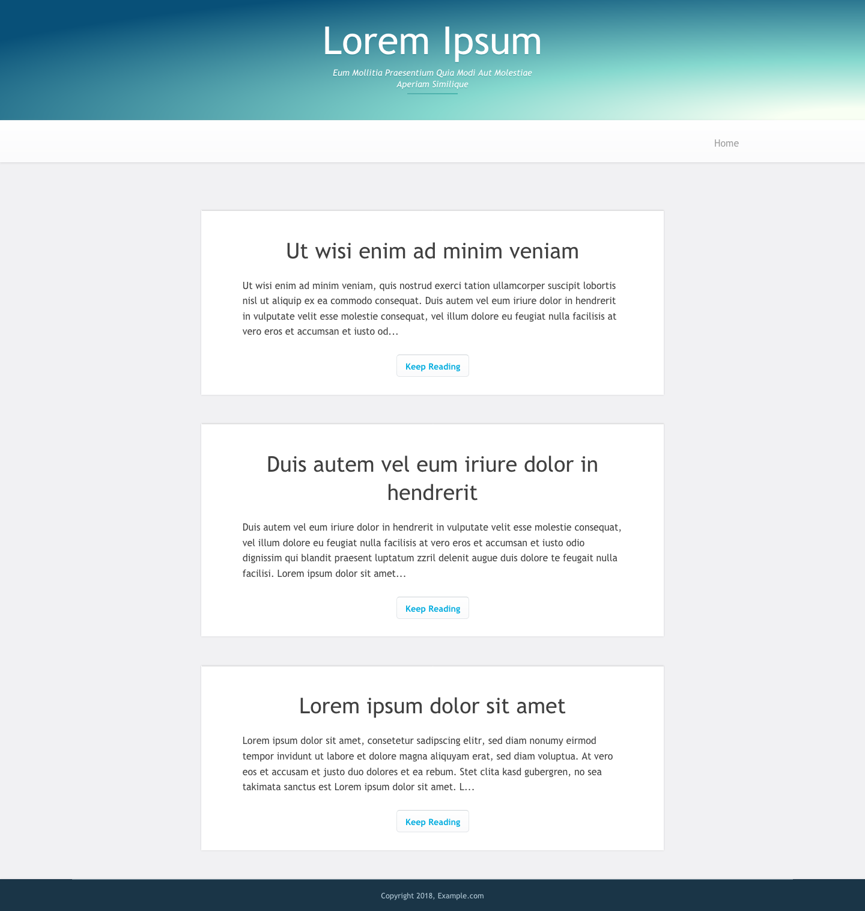
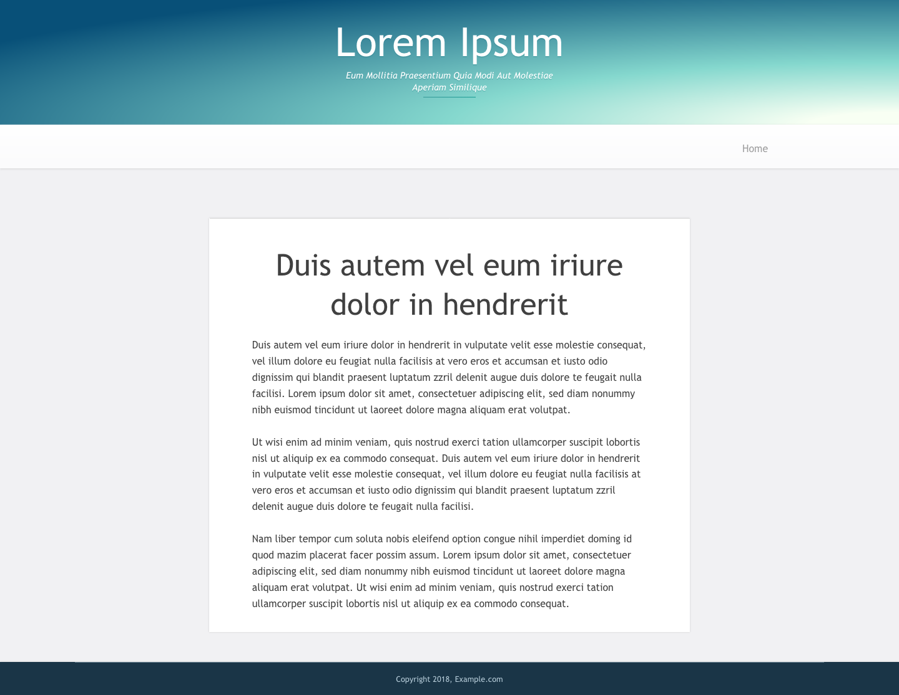

# Gin theme for Journal
Adaption of WordPress [Jinn theme](https://github.com/jekkilekki/theme-jin) for [Journal](https://github.com/vantezzen/journal).

# Installation
1. [Download this repository](https://github.com/vantezzen/journal-gin/archive/master.zip)
2. In your Journal `themes/` folder, create a new `gin` folder
3. Copy the repository contents into the `themes/gin/` folder
4. Go to Journals' settings, under "Theme" choose "gin"
5. Save settings - Your blog should now be in the CleanBlog theme

# Screenshots

